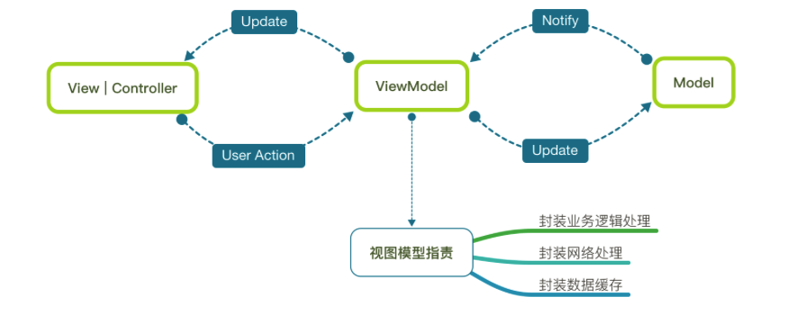

# IOS-framework
Swift语言基础框架，MVVM模式进行开发

# 三方框架管理工具
使用cocoapods进行三方框架的管理，cocoapods的安装可参考：
http://www.cocoachina.com/ios/20180110/21815.html

# 三方框架
1. 以下框架均可到github根据关键字搜索，搜索到源码，可自行学习及查看使用方法；
2. 在项目开发过程中，可根据业务逻辑添加、更换或升级所需要的框架，详见项目中Podfile文件

|序号|框架|版本|说明
|---|---|---|---
|1. |Alamofire|4.7|网络层基础库 
|2. |RxSwift|4.0|函数响应式编程框架
|3. |RxCocoa|4.0|函数响应式编程框架
|4. |Moya|11.0|基于Alamofire封装的网络框架
|5. |Moya/RxSwift|11.0|Moya对RxSwift的扩展支持框架
|6. |ObjectMapper|3.3|对象模型转换框架
|7. |SwiftyJSON|4.0|JSON解析框架
|8. |SnapKit|4.0.0|自动布局框架
|9. |RealmSwift|3.7.5|数据库封装框架
|10. |IQKeyboardManagerSwift|5.0.8|键盘回收框架
|11. |CryptoSwift|0.12.0|Swift加密框架（对称、非对称、哈希等）
|12. |Kingfisher|4.9.0|图片缓存框架
|13. |DateToolsSwift|4.0.0|工具类-时间转换框架
|14. |SwiftProgressHUD|0.0.7|Swift HUD
|15. |XCGLogger|6.1.0|日志系统框架

# 查看数据库
appStore 下载Reaml Browser.app到mac，打开本项目app对应的沙盒目录，可以看到SCDatabase.realm文件，使用Reaml Browser.app打开该文件，即可查看数据库表设计及数据

# 框架说明
1. 该iOS-Swift框架使用MVVM模式进行开发，更多MVVM框架知识自行学习
2. 该iOS-Swift框架使用RxSwift来实现MVVM的双向绑定
3. 核心技术：MVVM + RxSwift + Moya + ObjectMapper + SwiftyJSON



# 目录结构
```
.
├── Assets.xcassets
│   ├── AppIcon.appiconset
│   └── LaunchImage.launchimage
├── Base
├── Base.lproj
├── Classes
│   ├── Public
│   │   ├── GeneralVM
│   │   └── Service
│   └── UI
│       ├── Home
│       │   ├── Controller
│       │   ├── Model
│       │   ├── View
│       │   └── ViewModel
│       └── Login
│           ├── Controller
│           ├── Model
│           ├── View
│           └── ViewModel
├── Database
│   └── Table
├── Expand
│   ├── Const
│   ├── Extension
│   └── Utils
├── Network
│   ├── API
│   ├── NetworkLib
│   └── Response
├── Resources
│   ├── Files
│   │   └── Language
│   │       ├── Base.lproj
│   │       └── en.lproj
│   ├── IBs
│   ├── Images
│   │   └── Login&Register
│   └── Medias
└── Vendors
├── OC
│   └── SSKeyChain
└── Swift
```

# 启动项目
直接打开CYBaseiOSFrame.xcworkspace工程，build即可，如果编译过程报三方库找不到，则按下面步骤启动：
1. 安装cocoapods：http://www.cocoachina.com/ios/20180110/21815.html
2. 打开终端
3. cd到.xcodeproj文件所在的目录中，即../IOS-framework/CYBaseiOSFrame
4. 安装三方框架：执行pod install
5. 打开CYBaseiOSFrame.xcworkspace，编译运行

# 例子
参考项目中登录功能的实现，该模块包含了
1. 界面搭建
2. SnapKit自动布局框架的使用
3. RxSwfit函数式编程框架的使用
4. Moya网络框架的使用
5. ObjectMapper 对象模型的使用
6. SwiftyJSON json解析框架的使用
7. Realm数据库的使用
8. 网络部分使用了SSKeyChain，Swift和OC两种语言的混编，Swift调用OC代码，桥接
9. 国际化
10. MVVM框架模式下编程-双向绑定
11. Swift语法：协议、泛型等知识点

# 编写规范
1. 遵守iOS Swift开发编写规范，驼峰命名，类和变量的命名等，参考：https://blog.csdn.net/sinat_28585351/article/details/51909698
2. 三方框架的使用规范和MVVM框架编写规范，详细自行学习
3. 重点要提及的是Expand目录下面，一些扩展方法和工具类工具方法的使用

## Expand目录
1. CYCustomButtonUtil.class 定义了项目常用的button的样式
2. CYDrawUtil.class定义了常用绘制方法，如圆角和button背景图
3. CYStyleConst定义了该项目设计定义的一套风格，字体、字号、色值、色调
4. 颜色设置可直接调用kRGBColorFromHex方法
5. CYScreenConst定义了屏幕适配的一些参数以及APP系统版本信息
6. CYDocumentsConst定义了文件夹路径及获取文件的工具方法
7. 对于第六点的补充，图片统一放在../Resource/images/业务forder下面，使用loadPng(imageName)的方法调用，尤其是使用频率低的大图片，请勿放在Assets目录下，请勿使用imageNamed()方法进行调用
8. CYNetworkConst定义了网络请求的配置，host和route等
9. CYConfigConst 系统配置参数
10. 对123点的补充，统一管理APP的风格，有利于后期维护，如果出现换肤的功能，基本上封装个方法就可以了，风格常量代码尽量不要写死在页面里
